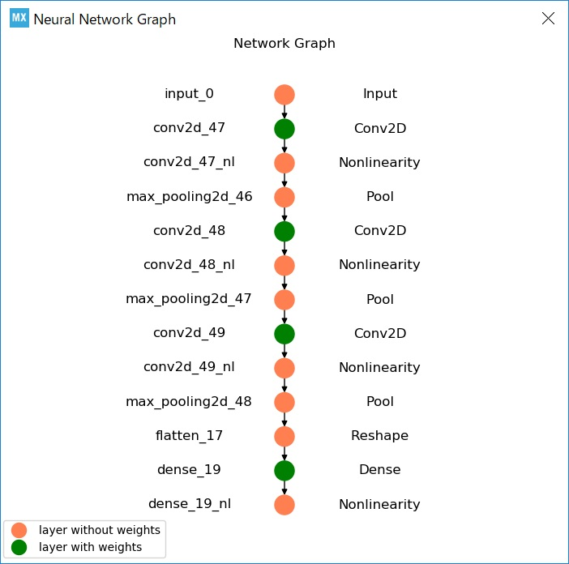

# Acoustic features for deep learning


**=> [Acoustic feature gallery (2D images)](./GALLERY.md)**

## Goal

Develop "edge AI" on a MCU for acoustic event detection.

## Project status (Feb 9, 2019)

This project is still in development:
- All the pre-processing features and the oscilloscope GUI have been implemented.
- Several CNN models on Keras/TensorFlow have already been tested.
- Inference engine based on Keras/TensorFlow has been implemented for Win10 and RasPi3.
- Implementation of DCT Type-II (for MFCCs) on STM32 has been completed.
- Evaluation on X-CUBE-AI has been completed in [another project](https://github.com/araobp/stm32-mcu/tree/master/NUCLEO-F401RE/AI)

At the moment, I am working on integrating the current system with X-CUBE-AI.

## Architecture

```
                                          *** pre-processing ***             *** inference ***
                                          ARM Cortex-M4(STM32L476RG)        Another core of ARM Cortex-M
                                      .................................... .............................
                                      :   Filters for feature extraction : :    Inference on CNN       :
Sound/voice ))) [MEMS mic]--PDM-->[DFSDM]--+->[]->[]->[]->[]---+----Features---->[X-CUBE-AI]           :
                                      :    |                   |         : :                           :
                                      :    +------------+      |         : :                           :
                                      :     +-----------|------+         : :                           :
                                      :     |           |                : :                           :
                                      :     V           V                : :                           :
                                      :..[USART]......[DAC]..............: :...........................:
                                            |           |
                                            |           | *** monitoring ***
                                            |           +---> [Analog filter] --> head phone
                                       (features)
                                            |
                                            | *** learning ***
                                            +--(dataset)--> [oscilloscope.py/Win10 or RasPi3] Keras/TensorFlow
                                            |
                                            | *** inference ***
                                            +--(dataset)--> [oscilloscope.py/Win10 or RasPi3] Keras/TensorFlow
```

Platform:
- [Platform and tool chain](./PLATFORM.md)

## System components

- ["Acoustic feature camera" for deep learning (CubeMX/TrueSTUDIO)](./stm32/acoustic_feature_camera)
- [Arduino shield of two Knowles MEMS microphones with beam forming support (KiCAD)](./kicad)
- [Oscilloscope GUI implementation on matplotlib/Tkinter (Python)](./oscilloscope)
- Inference engine (X-CUBE-AI with Keras/TensorFlow)

## Calibration

- [DFSDM calibration for Knowles MEMS microphones](./oscilloscope/CALIBRATION.md)

## Potential use cases

- musical instrument recognition and music performance analysis
- human activity recognition
- always-on automatic speech recogniton (e.g., "OK Google")
- automatic questionnaire collection in a restaurant
- birds chirping recognition

## Installing the device

The device is fixed on the wall or on the tree in the horizontal direction:
```
            y ^    /
              |   /
              |  /
              | / ) Theta
             (z)---------->
                          x
         -----------
         Wall or tree
```

In case of a living room:
```

   +-------------------------------------+
   |TV set            y ^        Cubboard|
   |       Table        |   Table Fridge |
   |                   (z)---->   Kitchen|
   |       Telephone [Device] x  Ventilation fan
   +-+-----+---------------------+-----+-+
      Door                        Door
                              Washing machine

```

### CNN experiments (learning and inference)

#### On Jupyter

- [CNN experiments with Keras/TensorFlow](./tensorflow)

#### System performance test code generated by [X-CUBE-AI](https://www.st.com/en/embedded-software/x-cube-ai.html) for STM32L476RG

- [CNN model used for this performance test](./tensorflow/CNN_for_AED_music.ipynb)
- [X-CUBE-AI screen shot](./stm32/ai_test/performance/screenshot1.jpg)


  
```
Running PerfTest on "network" with random inputs (16 iterations)...
................

Results for "network", 16 inferences @80MHz/80MHz (complexity: 340270 MACC)
 duration     : 58.069 ms (average)
 CPU cycles   : 4645555 -105/+111 (average,-/+)
 CPU Workload : 5%
 cycles/MACC  : 13 (average for all layers)
 used stack   : 352 bytes
 used heap    : 0:0 0:0 (req:allocated,req:released) cfg=0
 ```

The window size for learning/infering a musical instrument: 13.2mec x 64 frames = 0.83 sec

Conclusion:
- One core suffices for musical instrument recognition.
- It will require another core to focus on inference for keyword detection.

Note: X-CUBE-AI still seems to generate a network-runtime.a having a liker problem for "Application Template", so I choose System Performance instead to generate code of a neural network, then remove the part of system performance test.

## References

- ["New Architectures Bringing AI to the Edge"](https://www.eetimes.com/document.asp?doc_id=1333920).
- [VGGish](https://github.com/tensorflow/models/tree/master/research/audioset)
- [Speech Processing for Machine Learning: Filter banks, Mel-Frequency Cepstral Coefficients (MFCCs) and What's In-Between](https://haythamfayek.com/2016/04/21/speech-processing-for-machine-learning.html)
- [STM32 Cube.AI](https://www.st.com/content/st_com/en/stm32-ann.html)

