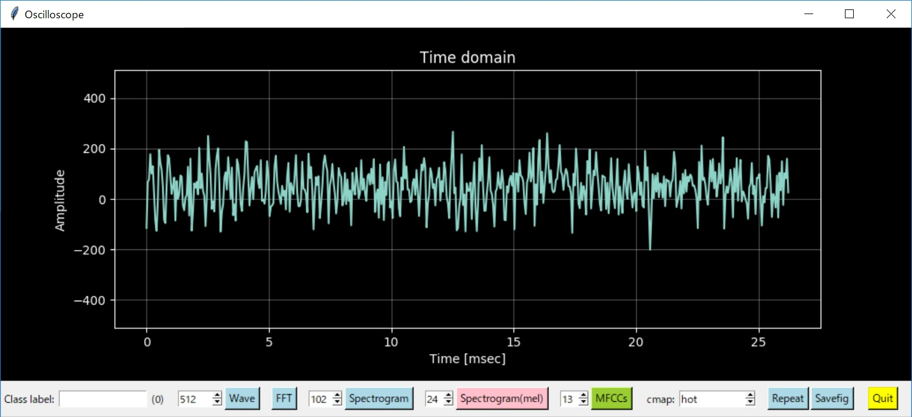

# Acoustic Event Detection with STM32L4 and TensorFlow

.jpg)

Framenco (Bulerias)

## Background and motivation

Although AI is booming, most of AI researchers use open data on the web for training a neural network. However, I focus on special AED(Acoustic Event Detection) use cases for myself, and I need to collect a lot of data by myself. It is a very time-consuming work, so I need to develop a data collecting device ("audio camera") that satisfies the following requirements:

- visualize sound in real-time: raw wave, FFT, spectrogram/mel-spectrogram and MFCCs.
- optimize parameters of MEMS mic parameters (DFSDM parameters) and filter/transform functions (pre-processing) to obtain the best sound image (mel-spectrogram) for training convolution layers of CNN.
- perform pre-processing on the edge: low-pass filtering, pre-emphasis and mel-spectorgram.
- collect data/image as an input to CNN.
- use the data collection device as an IoT edge device for deploying a trained CNN.
- low power consumption and small size.
- workable with BLE/CAN/LoRa
- free development tools avaiable for developing the edge device.

Starting point of this project is this paper: [CNN Architectures for Large-Scale Audio Classification](https://arxiv.org/abs/1609.09430)

However, I pursue small-scale audio classification of particular use cases for myself.

## Platform and tool chain

### Platform

STMicro STM32L4 (ARM Cortex-M4 with DFSDM, DAC, UART etc) is an all-in-one MCU that satisfies all the requirements above:
- [STMicro NUCLEO-L476RG](https://www.st.com/en/evaluation-tools/nucleo-l476rg.html): STM32L4 development board
- [STMicro X-NUCLEO-CCA02M1](https://www.st.com/en/ecosystems/x-nucleo-cca02m1.html): MEMS mic evaluation board

In addition, I use Knowles MEMS mics SPM0405HD4H to add extra mics to the platform above (for beam forming etc).

I already developed [an analog filter (LPF and AC couping)](https://github.com/araobp/stm32-mcu/tree/master/analog_filter) to monitor sound from DAC in real-time.

### Tool chain

- STMicro's [CubeMX](https://www.st.com/en/development-tools/stm32cubemx.html) and [TrueSTUDIO(Eclipse/GCC/GDB)](https://atollic.com/truestudio/) for firmware development.
- Jupyter Notebook for simulation.
- IDLE and numpy/pandas/matplotlib/Tkinter for developing Oscilloscope GUI.
- Google's Colab to train CNN.

## IoT network

```
Sound/voice ))) [MEMS mic]-[DFSDM][ARM Cortex-M4(STM32L4)]--Bluetooth/LPWA/CAN---+
                                                                                 |
Sound/voice ))) [MEMS mic]-[DFSDM][ARM Cortex-M4(STM32L4)]--Bluetooth/LPWA/CAN---+--[gateway]--> IoT application on the cloud
                                                                                 |
Sound/voice ))) [MEMS mic]-[DFSDM][ARM Cortex-M4(STM32L4)]--Bluetooth/LPWA/CAN---+
                                     |           [DAC]
                                     |             |
                                 USB serial     [Analog filter] --> head phone for monitoring sound from mic
                                     |
                                     v
                           [Oscilloscope GUI(Tk)] ----------------------> Google Drive --> Google Colab for training CNN
```

Refer to this page for the analog filter: https://github.com/araobp/stm32-mcu/tree/master/analog_filter

## Making use of DMA

STMicro's HAL library supports "HAL_DFSDM_FilterRegConvHalfCpltCallback" that is very useful to implemente ring-buffer-like buffering for real-time processing.

I splitted buffers for DMA into two segments: segment A and segment B.

```
Sound/voice ))) [MEMS mic]-PDM->[DFSDM]-DMA->[A|B]->[ARM Cortex-M4]
                                                    [ARM Cortex-M4]->[A|B]->DMA->[UART] --- > PC(pyserial)
                                                    [ARM Cortex-M4]->[A|B]->DMA->[DAC] ))) Sound/Voice

```

All the DMAs are synchronized, because their master clock is the system clock.

## Sampling frequency

- The highest frequency on a piano is 4186Hz, but it generate overtones: ~10kHz.
- Human voice also generates overtones: ~ 10kHz.

So the sampling frequency of MEMS mic should be around 20kHz: 20kHz/2 = 10kHz ([Nyquist frequency](https://en.wikipedia.org/wiki/Nyquist_frequency))

## Parameters of DFSDM (digital filter for sigma-delta modulators) on STM32L4

- System clock: 80MHz
- Clock divider: 32
- FOSR/decimation: 128
- sinc filter: sinc3
- right bit shift: 3 (2 * 128^3 = 2^22, so 6-bit-right-shift is required to output 16bit PCM)
- Sampling frequency: 80_000_000/32/128 = 19.5kHz

## Pre-processing on STM32L4/CMSIS-DSP

```
      MEMS mic
         |
         V
   DFSDM w/ DMA
         |
  [16bit PCM data] --> DAC w/ DMA for montoring the sound with a headset
         |
  float32_t data
         |
         |                .... CMSIS-DSP APIs() .........................................
  [ AC coupling  ]-----+  arm_mean_f32(), arm_offset_f32
         |             |
  [ Pre-emphasis ]-----+  arm_fir_f32()
         |             |
[Overlapping frames]   |  arm_copy_f32()
         |             |
  [Windowins(hann)]    |  arm_mult_f32()
         |             |
  [   Real FFT   ]     |  arm_rfft_fast_f32()
         |             |
  [     PSD      ]-----+  arm_cmplx_mag_f32(), arm_scale_f32()
         |             |
  [Mel-spectrogram]----+  arm_dot_prod_f32()
         |             |
 [DCT Type-II(MFCCs)]  |  arm_rfft_fast_f32(), arm_scale_f32(), arm_cmplx_mult_cmplx_f32()
         |             |
         +<------------+
         |
 data the size of int8_t (in ASCII)
         |
         V
    UART w/ DMA
         |
         V
Oscilloscope GUI/IoT gateway
```

- My conclusion is that 80_000_000(Hz)/64(clock divider)/64(FOSR) with pre-emphasis(HPF) is the best setting for obtaining the best images of mel-spectrogram.
- I use a triangler filter bank to obtain mel-spectrogram, and I make each triangle filter having a same amount of area.

## Frame/stride/overlap

- number of samples per frame: 512
- length: 512/19.5kHz = 26.3msec
- stride: 13.2msec
- overlap: 50%(13.2msec)

```
26.3msec         stride
[b0|a1]            1a --> mel-scale spectrogram via filter bank or 12 MFCCs
   [a1|b1]         1b --> mel-scale spectrogram via filter bank or 12 MFCCs
      [b1|a2]      2a --> mel-scale spectrogram via filter bank or 12 MFCCs
         [a2|b2]   2b --> mel-scale spectrogram via filter bank or 12 MFCCs
            :
```
## Filter banks

Mel-scale spectrogram is used for training CNN

- Mel-scale: 40 filters (512 samples divided by (40 + 1))
- Linear-scale: 255 filters (512 samples divide by (255 + 1))

## log10 processing time issue

PSD caliculation uses log10 math function, but CMSIS-DSP does not support log10. log10 on the standard "math.h" is too slow. I tried math.h log10, and the time required for caluculating log10(x) does not fit into the time slot of sound frame, so I decided to adopt [log10 approximation](./ipynb/log10%20fast%20approximation.ipynb). The approximation has been working perfect so far.

#### Processing time (actual measurement)

In case of 1024 samples per frame:
- fir (cfft/mult/cifft/etc * 2 times): 17msec
- log10: 54msec
- log10 fast approximation: 1msec
- atan2: 53msec

Note: log10(x) = log10(2) * log2(x)

Reference: https://community.arm.com/tools/f/discussions/4292/cmsis-dsp-new-functionality-proposal

## Command over UART (USB-serial)

UART baudrate: 921600bps

```

        Sequence over UART(USB-serial)

    ARM Cortex-M4L                    PC
           |                          |
           |<-------- cmd ------------|
           |                          |
           |------ data output ------>|
           |                          |


Data is send in ASCII characters, and the data format is as follows:

d: data delimiter
e: data transmission end

1,2,3,4,d,...,5,6,7,8,d\n
9,10,11,12,d,...,13,14,15,16,d\n
17,18,19,20,d,...,21,22,23,24,e\n

```

|cmd|description     | output size             | purpose               |
|---|----------------|-------------------------|-----------------------|
|0  | RAW_WAVE       | N x 1                   | Input to oscilloscope |
|1  | PSD            | N/2 x 1                 | Input to ML           |
|2  | FILTERBANK     | N/6 x NUM_FILTERS       | (for testing)         |
|3  | FILTERED_MEL   | NUM_FILTERS x 200       | Input to ML           |
|4  | MFCC           | NUM_FILTERS x 200       | Input to ML           |
|5  | MFCC_STREAMING | NUM_FILTERS x 07fffffff | (for testing)         |
|6  | FILTERED_LINEAR| NUM_FILTERS x 200       | Input to ML           |

|cmd|description     | output size             | purpose               |
|---|----------------|-------------------------|-----------------------|
|P  | Enable pre-emphasis |                    |                       |
|p  | Disable pre-emphasis |                   |                       |

## Oscilloscope GUI

I use Tkinter with matplotlib to draw graph of waveform, FFT, spectrogram, MFCCs etc.



.jpg)

- [Oscilloscope GUI implementation on matplotlib/Tkinter](./oscilloscope)

## CNN experiments with Keras/TensorFlow (on Nov 6, 2018)

#### Jupyter Notebook of this experiment

I have made two CNN experiments as follows:

- [CNN experiments on musical instruments recognition (Jupyter Notebook)](./tensorflow/CNN_for_AED.ipynb)
- [CNN experiments on human activity in a living room (Jupyter Notebook)](./tensorflow/CNN_for_AED_living_room.ipynb)

The trained CNN model will work OK if the following condition is satisfied:
- use the same MEMS mic with the same filter setting (incl. the same frequency response) on the edge device (STM32L4)
- same environment
- no surrounding noise

Next, I will try beam forming with two MEMS mic to supress noise from the surrounding envirnment.

#### Class labels and data set

```
Classes:
- piano music
- classial guitar music
- framenco guitar music
- blues harp music
- tin whistle music

Conditions:
- Pre emphasis enabled on the raw data.

I split each 40 mel-filters x 200 strdes data into three three 40 x 64 data.

Training data set: 48 mel-scale spectrograms (40 filters x 64 strides) for each class
Test data set: 24 mel-scale spectrograms (40 filters x 64 strides) for each class
```

#### CNN model

```
_________________________________________________________________
Layer (type)                 Output Shape              Param #   
=================================================================
conv2d_70 (Conv2D)           (None, 60, 36, 16)        416       
_________________________________________________________________
max_pooling2d_70 (MaxPooling (None, 30, 18, 16)        0         
_________________________________________________________________
conv2d_71 (Conv2D)           (None, 26, 14, 32)        12832     
_________________________________________________________________
max_pooling2d_71 (MaxPooling (None, 13, 7, 32)         0         
_________________________________________________________________
flatten_24 (Flatten)         (None, 2912)              0         
_________________________________________________________________
dense_47 (Dense)             (None, 64)                186432    
_________________________________________________________________
dense_48 (Dense)             (None, 5)                 325       
=================================================================
Total params: 200,005
Trainable params: 200,005
Non-trainable params: 0
_________________________________________________________________
```

#### Training result

```
Train on 1005 samples, validate on 495 samples
Epoch 1/10
1005/1005 [==============================] - 21s 21ms/step - loss: 0.8394 - acc: 0.6388 - val_loss: 0.4388 - val_acc: 0.8444
Epoch 2/10
1005/1005 [==============================] - 19s 19ms/step - loss: 0.3728 - acc: 0.8269 - val_loss: 0.4255 - val_acc: 0.8283
Epoch 3/10
1005/1005 [==============================] - 19s 19ms/step - loss: 0.2645 - acc: 0.8925 - val_loss: 0.3265 - val_acc: 0.8364
Epoch 4/10
1005/1005 [==============================] - 19s 19ms/step - loss: 0.2041 - acc: 0.9174 - val_loss: 0.2839 - val_acc: 0.8808
Epoch 5/10
1005/1005 [==============================] - 19s 19ms/step - loss: 0.1691 - acc: 0.9373 - val_loss: 0.5328 - val_acc: 0.8404
Epoch 6/10
1005/1005 [==============================] - 19s 19ms/step - loss: 0.1574 - acc: 0.9393 - val_loss: 0.2934 - val_acc: 0.8909
Epoch 7/10
1005/1005 [==============================] - 19s 19ms/step - loss: 0.1139 - acc: 0.9493 - val_loss: 0.3464 - val_acc: 0.8727
Epoch 8/10
1005/1005 [==============================] - 19s 19ms/step - loss: 0.1070 - acc: 0.9582 - val_loss: 0.2380 - val_acc: 0.9192
Epoch 9/10
1005/1005 [==============================] - 20s 20ms/step - loss: 0.0801 - acc: 0.9622 - val_loss: 0.2852 - val_acc: 0.9051
Epoch 10/10
1005/1005 [==============================] - 19s 19ms/step - loss: 0.0729 - acc: 0.9711 - val_loss: 0.2757 - val_acc: 0.9071
```

#### Using the trained model

Just run [this agent](./tensorflow/agent.py).

```
<<< (17) this is framenco_guitar (85.7%) >>>
blues_harp: 0.0%
classical_guitar: 13.0%
framenco_guitar: 85.7%
piano: 0.5%
tin_whistle: 0.0%
```
