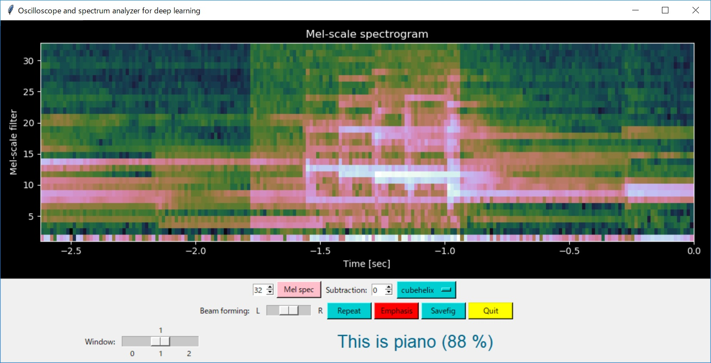

# Acoustic features for deep learning

## Acoustic feature gallery (2D images)


**=>[GALLERY](./GALLERY.md)**

## Project status (Dec 26, 2018)

This project is still in development:
- All the pre-processing features and the oscilloscope GUI have been implemented.
- Several CNN models on Keras/TensorFlow have already been tested.
- Inference engine based on Keras/TensorFlow has been implemented for Win10 and RasPi3.
- Implementation of DCT Type-II (for MFCCs) on STM32 has been completed.

And I am currently working on STM32 Cube.AI: [Getting started with STM32Cube.AI (youtube)](https://www.youtube.com/watch?v=grgNXdkmzzQ&list=PLnMKNibPkDnG9IC5Nl9vJg1CKMAO1kODW&t=141s&index=2)


## Architecture

```
                                          *** pre-processing ***             *** inference (*1) ***
                                          ARM Cortex-M4(STM32L476RG)        Another core of ARM Cortex-M
                                      .................................... .............................
                                      :   Filters for feature extraction : :    Inference on CNN       :
Sound/voice ))) [MEMS mic]--PDM-->[DFSDM]--+->[]->[]->[]->[]---+----Features-->[Cube.AI]               :
                                      :    |                   |         : :                           :
                                      :    +------------+      |         : :                           :
                                      :     +-----------|------+         : :                           :
                                      :     |           |                : :                           :
                                      :     V           V                : :                           :
                                      :..[USART]......[DAC]..............: :...........................:
                                            |           |
                                            |           | *** monitoring ***
                                            |           +---> [Analog filter] --> head phone
                                       (features)
                                            |
                                            | *** learning ***
                                            +--(dataset)--> [oscilloscope.py/Win10 or RasPi3] Keras/TensorFlow
                                            |
                                            | *** inference ***
                                            +--(dataset)--> [oscilloscope.py/Win10 or RasPi3] Keras/TensorFlow
```

Platform:
- [Platform and tool chain](./PLATFORM.md)

## System components

- ["Acoustic feature camera" for deep learning (CubeMX/TrueSTUDIO)](./stm32)
- [Arduino shield of two MEMS microphones with beam forming support (KiCAD)](./kicad)
- [Oscilloscope GUI implementation on matplotlib/Tkinter (Python)](./oscilloscope)

## Potential use cases

- musical instrument recognition and music performance analysis
- human activity recognition
- always-on automatic speech recogniton (e.g., "OK Google")
- automatic questionnaire collection in a restaurant
- birds chirping recognition

## Installing the device

The device is fixed on the wall or on the tree in the horizontal direction:
```
            y ^    /
              |   /
              |  /
              | / ) Theta
             (z)---------->
                          x
         -----------
         Wall or tree
```

In case of a living room:
```

   +-------------------------------------+
   |TV set            y ^        Cubboard|
   |       Table        |   Table Fridge |
   |                   (z)---->   Kitchen|
   |       Telephone [Device] x  Ventilation fan
   +-+-----+---------------------+-----+-+
      Door                        Door
                              Washing machine

```

### CNN experiments (learning and inference)



- [CNN experiments with Keras/TensorFlow](./tensorflow)

## References

- ["New Architectures Bringing AI to the Edge"](https://www.eetimes.com/document.asp?doc_id=1333920).
- [VGGish](https://github.com/tensorflow/models/tree/master/research/audioset)
- [Speech Processing for Machine Learning: Filter banks, Mel-Frequency Cepstral Coefficients (MFCCs) and What's In-Between](https://haythamfayek.com/2016/04/21/speech-processing-for-machine-learning.html)
- [STM32 Cube.AI](https://www.st.com/content/st_com/en/stm32-ann.html)

