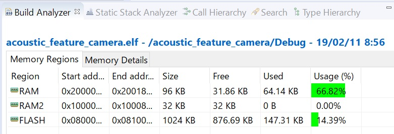

# Acoustic features for edge AI


**=> [Acoustic feature gallery (2D images)](./GALLERY.md)**

## Demo video on YouTube

**=> [Edge AI demo](https://www.youtube.com/watch?v=wbkjt2Bl5TY)**

## Use cases in this project

- always-on key word detection (e.g., "OK Google" or "Alexa!")
- musical instrument classification
- environmental sound classification

I have tested all of the use cases above, and confirmed that my device can classify acoustic scenes.

**Note: the size of neural network is so small that it is not a general purpose tool -- it is good at very limited number of classes.**

## Architecture

```
                                                         ARM Cortex-M4(STM32L476RG)
                                         ***** pre-processing *****           ***** inference *****
                                      ................................................................
                                      :   Filters for feature extraction        Inference on CNN     :
                                      :                                         ..................   :
Sound/voice ))) [MEMS mic]--PDM-->[DFSDM]--+->[]->[]->[]->[]---+----Features--->: code generated :   :
                                      :    |                   |                : by X-CUBE-AI   :   :
                                      :    +------------+      |                ..................   :
                                      :     +-----------|------+                                     :
                                      :     |           |                                            :
                                      :     V           V                                            :
                                      :..[USART]......[DAC]..........................................:
                                            |           |
                                            |           | *** monitoring raw sound ***
                                            |           +---> [Analog filter] --> head phone
                                       (features)
                                            |
                                            | *** learning ***
                                            +--(dataset)--> [oscilloscope.py/Win10 or RasPi3] Keras/TensorFlow
                                            |
                                            | *** inference ***
                                            +--(dataset)--> [oscilloscope.py/Win10 or RasPi3] Keras/TensorFlow
```

Platform:
- [Platform and tool chain](./PLATFORM.md)

## System components

I developed the following components:

- ["Acoustic feature camera" for deep learning (CubeMX/TrueSTUDIO)](./stm32/acoustic_feature_camera)
- [Arduino shield of two Knowles MEMS microphones with beam forming support (KiCAD)](./kicad)
- [Oscilloscope GUI implementation on matplotlib/Tkinter (Python)](./oscilloscope)

## Deep learning on Keras/TensorFlow

I acquired data on my own by using the components above, and it took a lot of time and effort.

- [Dataset of each use case](./dataset)
- [My use cases on Jupyter Notebook](./tensorflow)

### Modeling a neural network

To run a neural network on MCU (STM32 in this project), it is necessary to make the network small enough to fit it into the RAM and the flash memory:
- Adopt a CNN model that is relatively smaller than other network models.
- Perform pre-processing based on signal processing to extract features for CNN.

Usually, raw sound data (PCM) is transformed into the following "coefficients" as features:
- MFSCs (Mel Frequency Spectral Coefficients): the technique is to mimic the human auditory system.
- MFCCs (Mel Frequency Cepstral Coefficients): the technique is similar to JPEG/MPEG's data compression.

**My experiments so far showed that MFSCs+CNN ourperformed MFCCs+DNN or MFCCs+CNN.** So I use MFSCs for deep learning in this project.

### Size of actual network

The following is a network model for key word detection I tested for the first time:

```
_________________________________________________________________
Layer (type)                 Output Shape              Param #   
=================================================================
conv2d_1 (Conv2D)            (None, 62, 38, 4)         40        
_________________________________________________________________
max_pooling2d_1 (MaxPooling2 (None, 31, 19, 4)         0         
_________________________________________________________________
conv2d_2 (Conv2D)            (None, 29, 17, 8)         296       
_________________________________________________________________
max_pooling2d_2 (MaxPooling2 (None, 14, 8, 8)          0         
_________________________________________________________________
conv2d_3 (Conv2D)            (None, 12, 6, 16)         1168      
_________________________________________________________________
max_pooling2d_3 (MaxPooling2 (None, 6, 3, 16)          0         
_________________________________________________________________
flatten_1 (Flatten)          (None, 288)               0         
_________________________________________________________________
dropout_1 (Dropout)          (None, 288)               0         
_________________________________________________________________
dense_1 (Dense)              (None, 5)                 1445      
=================================================================
Total params: 2,949
Trainable params: 2,949
Non-trainable params: 0
```

And memory usage of the Keras model on X-CUBE-AI:



To my surprise, my experiment showed that it only recognizes vowels, not words. To make it more practical, I added "vowel" classes ("a", "i" and "o") and enlarged the network a littel more (RAM consumption: 25KBytes). The network seemed to learn the difference between words and vowels. Now, it works much better and can recognize key words.

```
_________________________________________________________________
Layer (type)                 Output Shape              Param #   
=================================================================
conv2d_4 (Conv2D)            (None, 62, 38, 8)         80        
_________________________________________________________________
max_pooling2d_4 (MaxPooling2 (None, 31, 19, 8)         0         
_________________________________________________________________
conv2d_5 (Conv2D)            (None, 29, 17, 16)        1168      
_________________________________________________________________
max_pooling2d_5 (MaxPooling2 (None, 14, 8, 16)         0         
_________________________________________________________________
conv2d_6 (Conv2D)            (None, 12, 6, 32)         4640      
_________________________________________________________________
max_pooling2d_6 (MaxPooling2 (None, 6, 3, 32)          0         
_________________________________________________________________
flatten_2 (Flatten)          (None, 576)               0         
_________________________________________________________________
dense_4 (Dense)              (None, 64)                36928     
_________________________________________________________________
dense_5 (Dense)              (None, 64)                4160      
_________________________________________________________________
dropout_2 (Dropout)          (None, 64)                0         
_________________________________________________________________
dense_6 (Dense)              (None, 8)                 520       
=================================================================
Total params: 47,496
Trainable params: 47,496
Non-trainable params: 0
_________________________________________________________________
```

I made a performance test on the network. The result is as follows:

```
Running PerfTest on "network" with random inputs (16 iterations)...
................

Results for "network", 16 inferences @80MHz/80MHz (complexity: 1218272 MACC)
 duration     : 172.688 ms (average)
 CPU cycles   : 13815048 -340/+454 (average,-/+)
 CPU Workload : 17%
 cycles/MACC  : 11 (average for all layers)
 used stack   : 352 bytes
 used heap    : 0:0 0:0 (req:allocated,req:released) cfg=0
 ```
## References

- ["New Architectures Bringing AI to the Edge"](https://www.eetimes.com/document.asp?doc_id=1333920).
- [VGGish](https://github.com/tensorflow/models/tree/master/research/audioset)
- [Speech Processing for Machine Learning: Filter banks, Mel-Frequency Cepstral Coefficients (MFCCs) and What's In-Between](https://haythamfayek.com/2016/04/21/speech-processing-for-machine-learning.html)
- [STM32 Cube.AI](https://www.st.com/content/st_com/en/stm32-ann.html)

