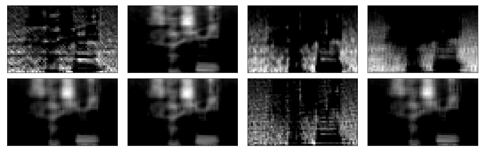
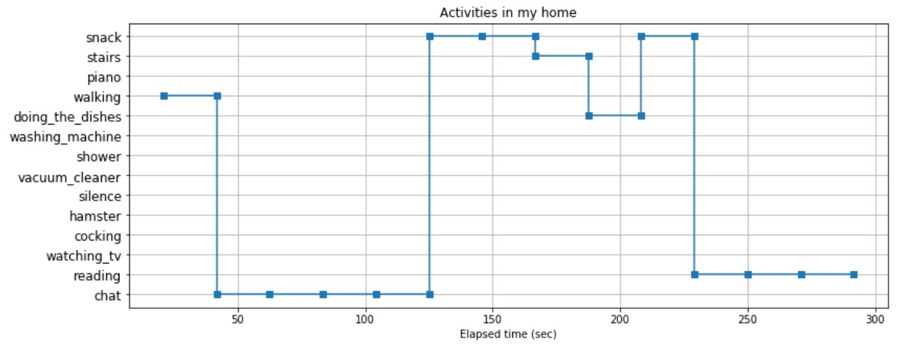

# Acoustic features for edge AI


**=> [Acoustic feature gallery (2D images)](./GALLERY.md)**

## Demo video on YouTube

Inference using X-CUBE-AI on STM32L476RG:
- [video](https://www.youtube.com/watch?v=wbkjt2Bl5TY)

Inference using Keras/TensorFlow on PC instead of X-CUBE-AI on STM32L476RG:
- [video 1](https://youtu.be/RV7oED41P2w)
- [video 2](https://youtu.be/4BaBL-gmQBk)

## Motivation

I have discoverd that **low-end edge AI works very well** as long as the conditions described in this README are satisfied.

## Use cases in this project

- always-on key word detection (e.g., "OK Google" or "Alexa!")
- musical instrument classification
- acoustic scene classification

I have tested all of the use cases above, and confirmed that my device can classify acoustic scenes.

**Note: the size of neural network is so small that it is not a general purpose tool -- it is good at very limited number of classes.**

## Architecture

```
                                                         ARM Cortex-M4(STM32L476RG)
                                         ***** pre-processing *****           ***** inference *****
                                      ................................................................
                                      :   Filters for feature extraction        Inference on CNN     :
                                      :                                         ..................   :
Sound/voice ))) [MEMS mic]--PDM-->[DFSDM]--+->[]->[]->[]->[]---+----Features--->: code generated :   :
                                      :    |                   |                : by X-CUBE-AI   :   :
                                      :    +------------+      |                ..................   :
                                      :     +-----------|------+                                     :
                                      :     |           |                                            :
                                      :     V           V                                            :
                                      :..[USART]......[DAC]..........................................:
                                            |           |
                                            |           | *** monitoring raw sound ***
                                            |           +---> [Analog filter] --> head phone
                                       (features)
                                            |
                                            | *** learning ***
                                            +--(dataset)--> [oscilloscope.py/Win10 or RasPi3] Keras/TensorFlow
                                            |
                                            | *** inference ***
                                            +--(dataset)--> [oscilloscope.py/Win10 or RasPi3] Keras/TensorFlow
```

Platform:
- [Platform and tool chain](./PLATFORM.md)

## System components

I developed the following components:

- ["Acoustic feature camera" for deep learning (CubeMX/TrueSTUDIO)](./stm32/acoustic_feature_camera)
- [Arduino shield of two Knowles MEMS microphones with beam forming support (KiCAD)](./kicad)
- [Oscilloscope GUI implementation on matplotlib/Tkinter (Python)](./oscilloscope)

## Deep learning on Keras/TensorFlow

I acquired data on my own by using the components above, and it took a lot of time and effort.

- [Dataset of each use case](./dataset)
- [My use cases on Jupyter Notebook](./tensorflow)
- [Data format](./FORMAT.md)

### Modeling a neural network

To run a neural network on MCU (STM32 in this project), it is necessary to make the network small enough to fit it into the RAM and the flash memory:
- Adopt a CNN model that is relatively smaller than other network models.
- Perform pre-processing based on signal processing to extract features for CNN.

Usually, raw sound data (PCM) is transformed into the following "coefficients" as features:
- MFSCs (Mel Frequency Spectral Coefficients): the technique is to mimic the human auditory system.
- MFCCs (Mel Frequency Cepstral Coefficients): the technique is similar to JPEG/MPEG's data compression.

**My experiments so far showed that MFSCs+CNN ourperformed MFCCs+DNN or MFCCs+CNN.** And DNN tends to use more memory space than CNN does (more flash memory space, in case of X-CUBE-AI). So I use MFSCs for deep learning in this project.

### CNN size

The following CNN model performs very well and avoids over-fittting in most of the use cases I have ever tried:

```
Orignal data size: PCM 16bit 512*32 (26.3msec*32)

SFFT/Spectrogram size
- Stride: 13.2msec * 64
- Ovelap: 50%

MFSCs resolution: filterbank of 40 triagle filters
Quantized input tensor: MFSCs int8_t (64, 40, 1)

However, X-CUBE-AI currently supports float32_t only, so int8_t is just for transmitting the data to PC over UART.

CNN model on Keras
_________________________________________________________________
Layer (type)                 Output Shape              Param #   
=================================================================
conv2d_81 (Conv2D)           (None, 62, 38, 8)         80        
_________________________________________________________________
max_pooling2d_79 (MaxPooling (None, 31, 19, 8)         0         
_________________________________________________________________
dropout_57 (Dropout)         (None, 31, 19, 8)         0         
_________________________________________________________________
conv2d_82 (Conv2D)           (None, 29, 17, 16)        1168      
_________________________________________________________________
max_pooling2d_80 (MaxPooling (None, 14, 8, 16)         0         
_________________________________________________________________
dropout_58 (Dropout)         (None, 14, 8, 16)         0         
_________________________________________________________________
conv2d_83 (Conv2D)           (None, 12, 6, 32)         4640      
_________________________________________________________________
max_pooling2d_81 (MaxPooling (None, 6, 3, 32)          0         
_________________________________________________________________
dropout_59 (Dropout)         (None, 6, 3, 32)          0         
_________________________________________________________________
flatten_27 (Flatten)         (None, 576)               0         
_________________________________________________________________
dense_62 (Dense)             (None, 128)               73856     
_________________________________________________________________
dropout_60 (Dropout)         (None, 128)               0         
_________________________________________________________________
dense_63 (Dense)             (None, 18)                2322      
=================================================================
Total params: 82,066
Trainable params: 82,066
Non-trainable params: 0
```

### Visualization of convolution layers



**=> [Japanese word "sushi" via convolution layer](./tensorflow/Visualization_sushi.ipynb)**

### Memory consumption and inference performance

I loaded a trained CNN model (Keras model) into Cube.AI and generated code for inference. The model consumed only 25KBytes of SRAM and 105Kbytes (compressed) of Flash memory, and the duration of inference was around 170msec on STM32L476RG.

The duration of 170msec is acceptible (not too slow) in my use cases.

And I know that Arm is working on [Helium](https://www.arm.com/why-arm/technologies/helium), so it will be able to process acoustic features for inference in real time.

## Noise problems

```
         Room impulse response
                   :
                   V
Sound -->(Line distortion)--(+)->[Feature engineering]--Feature->[Normalization]->[Neural Network]->Inference
              convolved      ^
                             | Added
                             |
                      (Ambient noise)
```

### Effect of room impulse response on inference

I have been observing that **room impulse response** (it turns into **line distortion**) has an lot of effect on inference.

My strategy for tackling the problem is:
- use **the same device** for both acquiring features and inference on the device.
- use the device **at the same location** for both acquiring features and inference.
- never change the values of parameters for feature engineering (e.g., parameters for filters).

If the above conditions are satisfied, this small neural network works very well.

### Effect of ambient noise on inference

I have been observing that sound of air conditioner affects accuracy of inference significantly.

## Applications

I have been working on a life log application.



## References

- ["New Architectures Bringing AI to the Edge"](https://www.eetimes.com/document.asp?doc_id=1333920).
- [VGGish](https://github.com/tensorflow/models/tree/master/research/audioset)
- [Speech Processing for Machine Learning: Filter banks, Mel-Frequency Cepstral Coefficients (MFCCs) and What's In-Between](https://haythamfayek.com/2016/04/21/speech-processing-for-machine-learning.html)
- [STM32 Cube.AI](https://www.st.com/content/st_com/en/stm32-ann.html)

