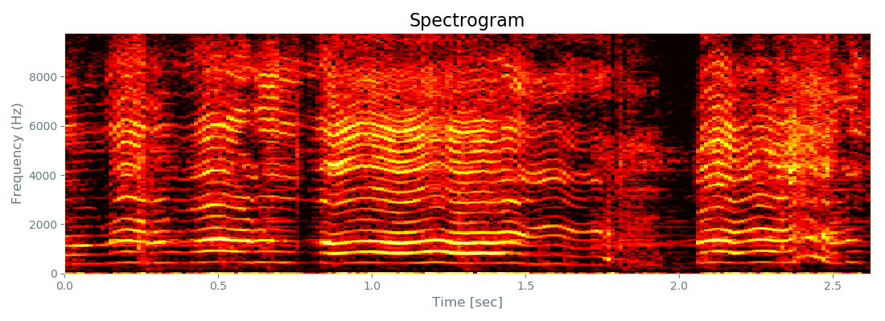

# Acoustic features for edge AI



**=> [Acoustic feature gallery (2D images)](./GALLERY.md)**

## Demo video on YouTube

**=> [Edge AI demo](https://www.youtube.com/watch?v=wbkjt2Bl5TY)**

## Use cases in this project

- always-on key word detection (e.g., "OK Google" or "Alexa!")
- musical instrument classification
- acoustic scene classification

I have tested all of the use cases above, and confirmed that my device can classify acoustic scenes.

**Note: the size of neural network is so small that it is not a general purpose tool -- it is good at very limited number of classes.**

## Architecture

```
                                                         ARM Cortex-M4(STM32L476RG)
                                         ***** pre-processing *****           ***** inference *****
                                      ................................................................
                                      :   Filters for feature extraction        Inference on CNN     :
                                      :                                         ..................   :
Sound/voice ))) [MEMS mic]--PDM-->[DFSDM]--+->[]->[]->[]->[]---+----Features--->: code generated :   :
                                      :    |                   |                : by X-CUBE-AI   :   :
                                      :    +------------+      |                ..................   :
                                      :     +-----------|------+                                     :
                                      :     |           |                                            :
                                      :     V           V                                            :
                                      :..[USART]......[DAC]..........................................:
                                            |           |
                                            |           | *** monitoring raw sound ***
                                            |           +---> [Analog filter] --> head phone
                                       (features)
                                            |
                                            | *** learning ***
                                            +--(dataset)--> [oscilloscope.py/Win10 or RasPi3] Keras/TensorFlow
                                            |
                                            | *** inference ***
                                            +--(dataset)--> [oscilloscope.py/Win10 or RasPi3] Keras/TensorFlow
```

Platform:
- [Platform and tool chain](./PLATFORM.md)

## System components

I developed the following components:

- ["Acoustic feature camera" for deep learning (CubeMX/TrueSTUDIO)](./stm32/acoustic_feature_camera)
- [Arduino shield of two Knowles MEMS microphones with beam forming support (KiCAD)](./kicad)
- [Oscilloscope GUI implementation on matplotlib/Tkinter (Python)](./oscilloscope)

## Deep learning on Keras/TensorFlow

I acquired data on my own by using the components above, and it took a lot of time and effort.

- [Dataset of each use case](./dataset)
- [My use cases on Jupyter Notebook](./tensorflow)

### Modeling a neural network

To run a neural network on MCU (STM32 in this project), it is necessary to make the network small enough to fit it into the RAM and the flash memory:
- Adopt a CNN model that is relatively smaller than other network models.
- Perform pre-processing based on signal processing to extract features for CNN.

Usually, raw sound data (PCM) is transformed into the following "coefficients" as features:
- MFSCs (Mel Frequency Spectral Coefficients): the technique is to mimic the human auditory system.
- MFCCs (Mel Frequency Cepstral Coefficients): the technique is similar to JPEG/MPEG's data compression.

**My experiments so far showed that MFSCs+CNN ourperformed MFCCs+DNN or MFCCs+CNN.** So I use MFSCs for deep learning in this project.

### Size of actual network

The following CNN model performed very well on most of the use cases I have ever tried:

```
Input tensor: MFSCs (64, 40, 1)

_________________________________________________________________
Layer (type)                 Output Shape              Param #   
=================================================================
conv2d_81 (Conv2D)           (None, 62, 38, 8)         80        
_________________________________________________________________
max_pooling2d_79 (MaxPooling (None, 31, 19, 8)         0         
_________________________________________________________________
dropout_57 (Dropout)         (None, 31, 19, 8)         0         
_________________________________________________________________
conv2d_82 (Conv2D)           (None, 29, 17, 16)        1168      
_________________________________________________________________
max_pooling2d_80 (MaxPooling (None, 14, 8, 16)         0         
_________________________________________________________________
dropout_58 (Dropout)         (None, 14, 8, 16)         0         
_________________________________________________________________
conv2d_83 (Conv2D)           (None, 12, 6, 32)         4640      
_________________________________________________________________
max_pooling2d_81 (MaxPooling (None, 6, 3, 32)          0         
_________________________________________________________________
dropout_59 (Dropout)         (None, 6, 3, 32)          0         
_________________________________________________________________
flatten_27 (Flatten)         (None, 576)               0         
_________________________________________________________________
dense_62 (Dense)             (None, 128)               73856     
_________________________________________________________________
dropout_60 (Dropout)         (None, 128)               0         
_________________________________________________________________
dense_63 (Dense)             (None, 18)                2322      
=================================================================
Total params: 82,066
Trainable params: 82,066
Non-trainable params: 0
```

The model consumes only 25KBytes of SRAM and 105Kbytes (compressed) of Flash memory.

## References

- ["New Architectures Bringing AI to the Edge"](https://www.eetimes.com/document.asp?doc_id=1333920).
- [VGGish](https://github.com/tensorflow/models/tree/master/research/audioset)
- [Speech Processing for Machine Learning: Filter banks, Mel-Frequency Cepstral Coefficients (MFCCs) and What's In-Between](https://haythamfayek.com/2016/04/21/speech-processing-for-machine-learning.html)
- [STM32 Cube.AI](https://www.st.com/content/st_com/en/stm32-ann.html)

