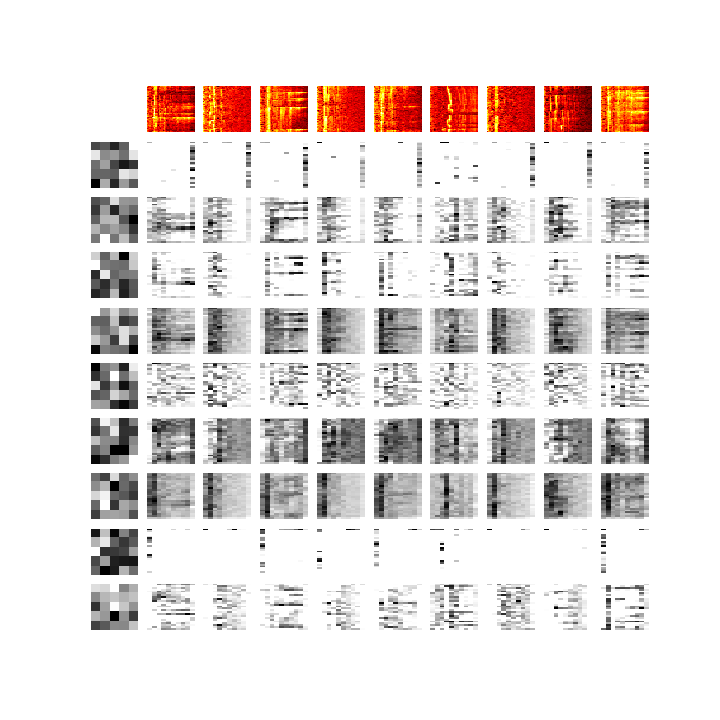

# Acoustic Event Detection with STM32L4 and TensorFlow

.jpg)

Tin whislte music

## Motivation

I want to develop the cheapest (and low-power-consumption) edge device of ML (for [VGGish](https://github.com/tensorflow/models/tree/master/research/audioset) and so on) with a MEMS mic, so I use **ARM Cortex-M4 and CMSIS-DSP** to calculate **Mel-scale spectrogram and MFCCs** on the edge in realtime, and to transfer **the compressed data** to an IoT cloud. It is a kind of CODEC for ML, since it uses FFT and DCT via a filter bank for compressing data. In future, I will use a ML processor or FPGA for NN deployment.

## IoT network

```
Sound/voice ))) [MEMS mic]-[DFSDM][ARM Cortex-M4(STM32L4)]--Bluetooth/LPWA/CAN---+
                                                                                 |
Sound/voice ))) [MEMS mic]-[DFSDM][ARM Cortex-M4(STM32L4)]--Bluetooth/LPWA/CAN---+--[gateway]--> IoT application on the cloud
                                                                                 |
Sound/voice ))) [MEMS mic]-[DFSDM][ARM Cortex-M4(STM32L4)]--Bluetooth/LPWA/CAN---+
                                     |           [DAC]
                                     |             |
                                 USB serial     [Analog filter] --> head phone for monitoring sound from mic
                                     |
                                     v
                           [Oscilloscope GUI(Tk)] ----------------------> Google Drive --> Google Colab for training CNN
```

Refer to this page for the analog filter: https://github.com/araobp/stm32-mcu/tree/master/analog_filter

## Making use of DMA

STMicro's HAL library supports "HAL_DFSDM_FilterRegConvHalfCpltCallback" that is very useful to implemente ring-buffer-like buffering for real-time processing.

I splitted buffers for DMA into two segments: segment A and segment B.

```
Sound/voice ))) [MEMS mic]-PDM->[DFSDM]-DMA->[A|B]->[ARM Cortex-M4]
                                                    [ARM Cortex-M4]->[A|B]->DMA->[UART] --- > PC(pyserial)
                                                    [ARM Cortex-M4]->[A|B]->DMA->[DAC] ))) Sound/Voice

```

All the DMAs are synchronized, because their master clock is the system clock.

## Sampling frequency

- The highest frequency on a piano is 4186Hz, but it generate overtones: ~10kHz.
- Human voice also generates overtones: ~ 10kHz.

So samplig frequency of MFCC streamer should be around 20kHz: 20kHz/2 = 10kHz.

## Parameters of DFSDM (digital filter for sigma-delta modulators) on STM32L4

- System clock: 80MHz
- Clock divider: 128
- FOSR/decimation: 32
- sinc filter: sinc3
- Sampling frequency: 80_000_000/128/32 = 19.5kHz

## Frame/stride/overlap

- number of samples per frame: 512
- length: 512/19.5kHz = 26.3msec
- stride: 13.2msec
- overlap: 50%(13.2msec)

```
26.3msec         stride
[b0|a1]            1a --> mel-scale spectrogram via filter bank or 12 MFCCs
   [a1|b1]         1b --> mel-scale spectrogram via filter bank or 12 MFCCs
      [b1|a2]      2a --> mel-scale spectrogram via filter bank or 12 MFCCs
         [a2|b2]   2b --> mel-scale spectrogram via filter bank or 12 MFCCs
            :
```
## Filter banks

Mel-scale spectrogram is used for training CNN

- Mel-scale: 40 filters (512 samples divided by (40 + 1))
- Linear-scale: 255 filters (512 samples divide by (255 + 1))

## Processing time (actual measurement)

In case of 1024 samples per frame:
- fir (cfft/mult/cifft/etc * 2 times): 17msec
- log10: 54msec
- log10 fast approximation: 1msec
- atan2: 53msec

Note: log10(x) = log10(2) * log2(x)

Reference: https://community.arm.com/tools/f/discussions/4292/cmsis-dsp-new-functionality-proposal

## log10 processing time issue

log10 of math.h is too slow for audio signal processing, but CMSIS DSP does not support log10. I decided to adopt [log10 approximation](./ipynb/log10%20fast%20approximation.ipynb).

## Command over UART (USB-serial)

UART baudrate: 921600bps

```

        Sequence over UART(USB-serial)

    ARM Cortex-M4L                    PC
           |                          |
           |<-------- cmd ------------|
           |                          |
           |------ data output ------>|
           |                          |


Data is send in ASCII characters, and the data format is as follows:

d: data delimiter
e: data transmission end

1,2,3,4,d,...,5,6,7,8,d\n
9,10,11,12,d,...,13,14,15,16,d\n
17,18,19,20,d,...,21,22,23,24,e\n

```

|cmd|description     | output size             | purpose               |
|---|----------------|-------------------------|-----------------------|
|0  | RAW_WAVE       | N x 1                   | Input to oscilloscope |
|1  | PSD            | N/2 x 1                 | Input to ML           |
|2  | FILTERBANK     | N/6 x NUM_FILTERS       | (for testing)         |
|3  | FILTERED_MEL   | NUM_FILTERS x 200       | Input to ML           |
|4  | MFCC           | NUM_FILTERS x 200       | Input to ML           |
|5  | MFCC_STREAMING | NUM_FILTERS x 07fffffff | (for testing)         |
|6  | FILTERED_LINEAR| NUM_FILTERS x 200       | Input to ML           |
|P  | Enable pre-emphasis |                    |                       |
|p  | Disable pre-emphasis |                   |                       |
|M  | Enable mean-normalization |              |                       |
|m  | Disable mean-normalization |             |                       |

## Oscilloscope GUI

I use Tkinter with matplotlib to draw graph of waveform, FFT, spectrogram, MFCCs etc.


.jpg)

- [Oscilloscope GUI implementation on matplotlib/Tkinter](./oscilloscope)

## CNN experiments on TensorFlow

I use the edge device above to obtain a lot of Mel-scale spectrograms for each class label, then I feed the data into CNN on Colab with GPU acceleration for training.



- [Experiments on Colab with GPU acceleration](./tensorflow)
