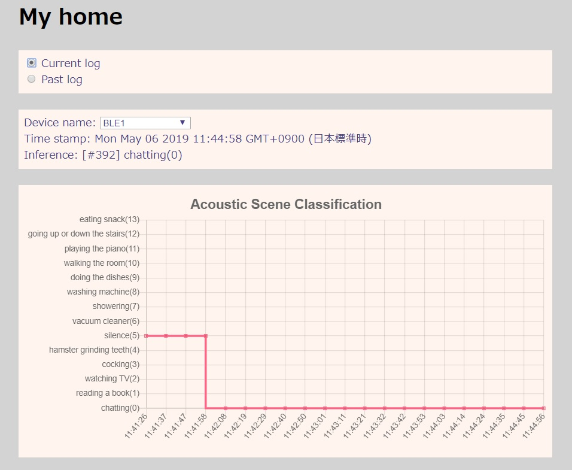
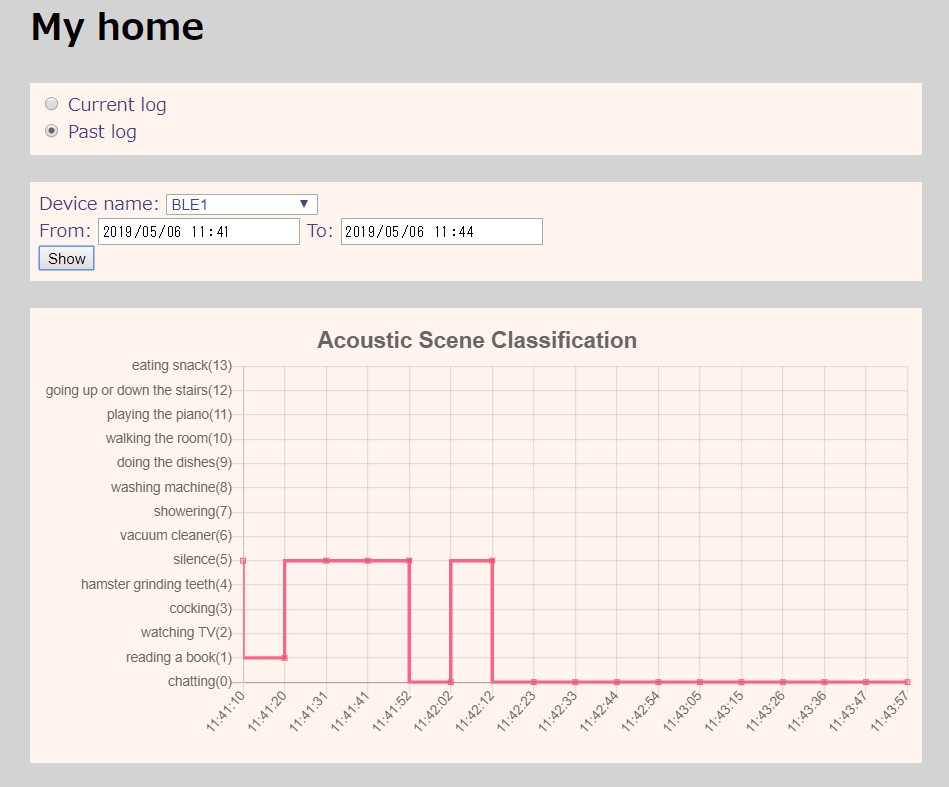

# Chart GUI SPA (Single Page Application)

## IoT platform

This SPA works on the following iot platform:

==> **[iot-wireless](https://github.com/araobp/iot-wireless)**

## Architecture

```
  [ChartGUI/HTML5]<--MQTT/WebSocket---[mosquitto]<--MQTT---[gateway.py]<--BLE---[MEMS-mic/STM32]
           ^                               |
           |                               V
           +---------REST------------[API server]--[SQLite]
```

## SPA code

|File                               |Description                  |
|-----------------------------------|-----------------------------|
|./main.html                        |Main                         |
|./use_cases/class_labels_xxxxxx.js |Config file for each use case|
|./lib/xxxxx.js                     |Local libraries              |

## Screen shots





## References

- [Vue.js](https://vuejs.org/)
- [Chart.js](https://www.chartjs.org/)
- [MQTT over WebSocket](http://www.steves-internet-guide.com/using-javascript-mqtt-client-websockets/)

