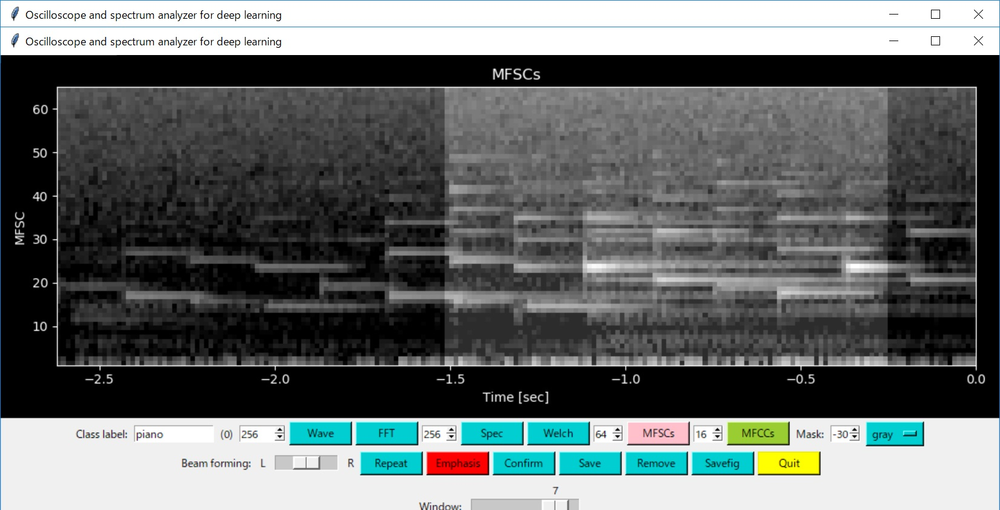
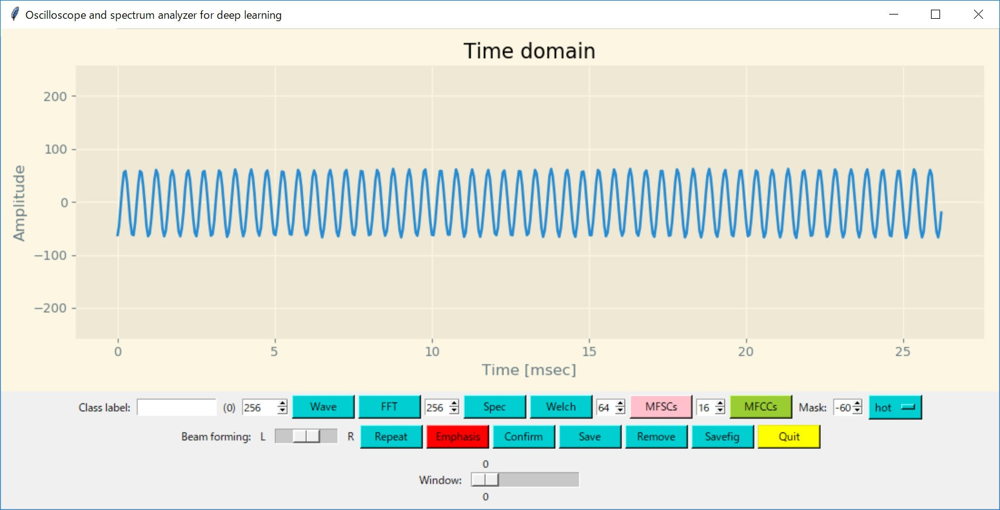
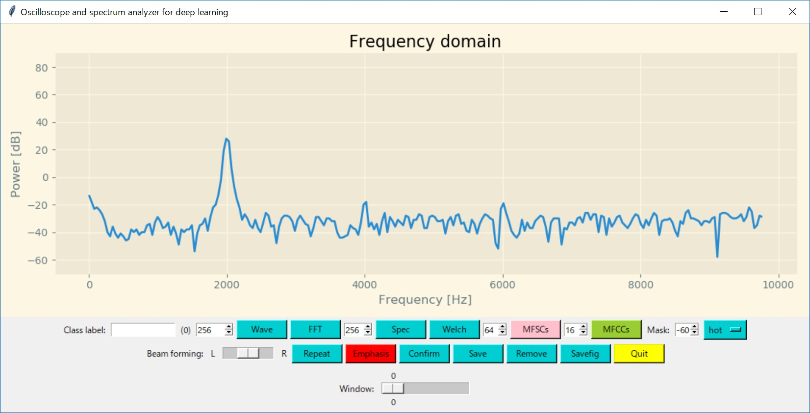
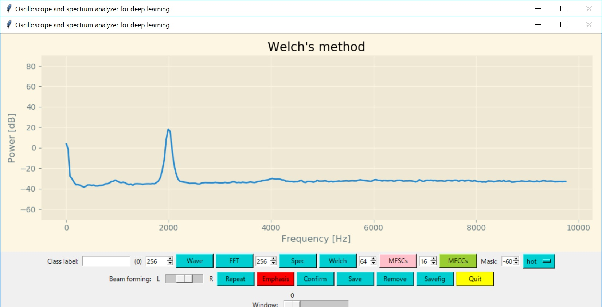
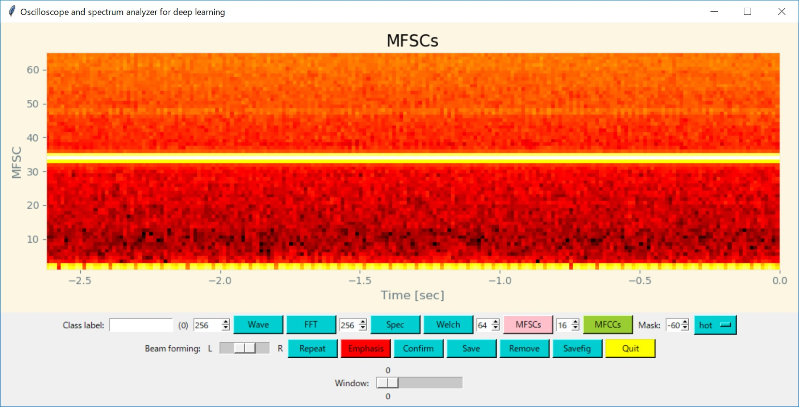
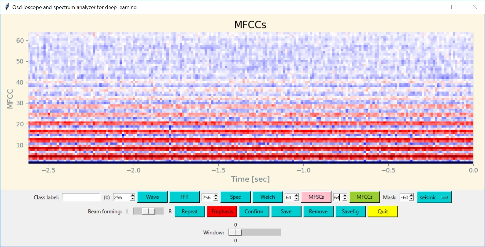

# Oscilloscope GUI

Th oscilloscope GUI is for visualizing wavefrom, FFT, spectrogram, MFSCs and MFCCs. Its core software component is "matplotlib" that is superimposed onto Tk. The GUI can also be used to acquire training data for CNN by just pressing a button on the GUI.

Connect PC to the edge device with a USB cable, and run "[run.bat](./run.bat)" to start the oscilloscope GUI:
```
Sound ))) [MEMS mic]--[Edge device(STM32L476RG)]<-- USB serial -->[Oscilloscope GUI (oscilloscope.py)]
```

### Using the oscilloscope GUI to collect data for training CNN

Run "[run_measurement.bat](./run_measurement.bat)" to obtain feature data set for training CNN. Data (MFSCs and MFCCs) acquired by the GUI is stored in [this default dataset folder](../dataset/data_measurement).



[Step 1] Enter a class label into the class label entry on the GUI.

[Step 2] Press "MFSCs" or "MFCCs" button to check if the edge device can transfer feature data to the GUI.

[Step 3] Press "Confirm" button.

[Step 4] Use cursor keys for data collection:

```
          [Up]
     [Left]   [Right]
         [Down]

Up: fetch feature data from the device
Left: move the window left
Right: move the window right
Down: save the data
```

The window on the screen is highlighted.

## Screen shots

Sine wave tone at a constant frequency is visualized by using the oscilloscope GUI in various methods.












### Using the oscilloscope GUI to calibrate DFSDM and MEMS microphones

==> **[Calibration](./CALIBRATION.md)**


