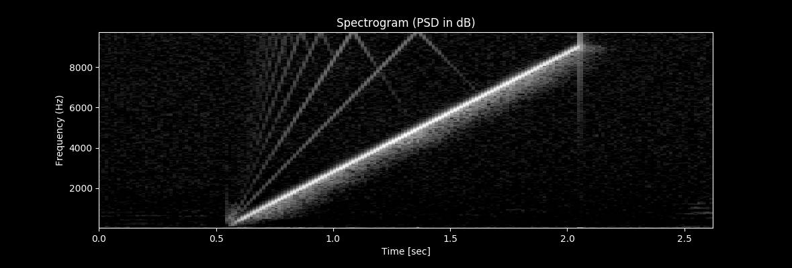
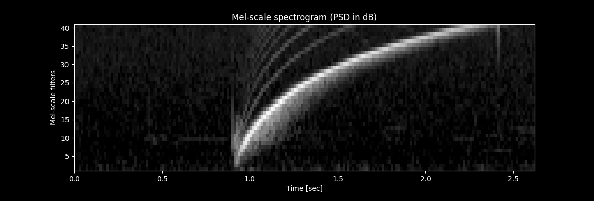
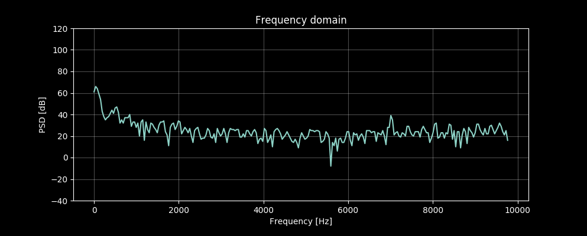

# Oscilloscope GUI

The oscilloscope GUI is for visualizing wavefrom, FFT, spectrogram and MFCCs calcuated on the edge device. Its core software component is "matplotlib" that is superimposed onto Tk. The GUI can also be used to acquire training data for CNN by just pressing a button on the GUI.

Connect PC to the edge device with a USB cable, and run [oscilloscope.py](./oscilloscope.py) to start the oscilloscope GUI:
```
Sound ))) [MEMS mic]--[Edge device(STM32L476RG)]<-- USB serial -->[Oscilloscope GUI (oscilloscope.py)]
```

## Screen shots

.jpg)

- [screen shots](./screenshots)

# Testing the oscilloscope

## Linear chirp spectrogram

Condition:
- Linear chirp
- 1.5sec length
- 50Hz(amplitude 0.8)-9000Hz(amplitude 0.1) sweep range
- generated by Audacity

Note: harmonic distortion including their aliases (harmonic distortion over Nyquist frequency) can be seen in the pictures below.

#### Linear chirp spectrogram



#### Linear chirp mel-spectrogram



# Calibrating MEMS mic and DFSDM

Condition: 7000 Hz sine wave is generated by a tone generator running on my PC, and the MEMS mic receives the tone via air.

## Measurement result

"System clock 80_000_000 / clock divider 32 / FOSR 128" outperformed System "clock 80_000_000 / clock divider 64 / FOSR 64": SNR is better at 7000Hz.

### System clock 80_000_000 / clock divider 64 / FOSR 64

#### Pre-emphasis disabled



#### Pre-emphasis enabled


### System clock 80_000_000 / clock divider 32 / FOSR 128

#### Pre-emphasis disabled


#### Pre-emphasis enabled


