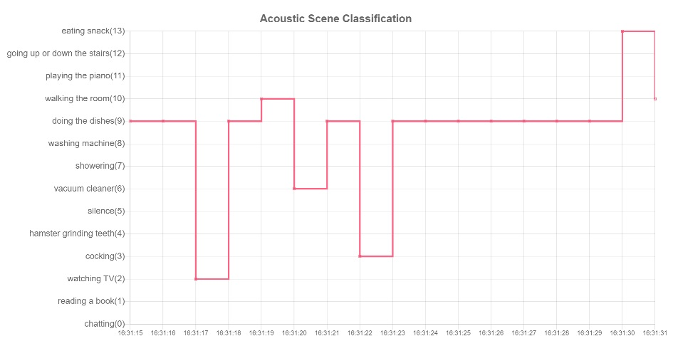

# Chart GUI SPA (Single Page Application)


          
## IoT platform

==> **[iot-wireless](https://github.com/araobp/iot-wireless)**

## Architecture

```
  [ChartGUI/HTML5]<--MQTT/WebSocket---[mosquitto]<--MQTT---[gateway.py]<--BLE---[MEMS-mic/STM32]
           ^                               |
           |                               V
           +---------REST------------[API server]--[SQLite]
```

## Chart for JS

I want to draw a line chart like the one supported by matplotlib.pyplot.step: https://matplotlib.org/api/_as_gen/matplotlib.pyplot.step.html

At first, I evaluated C3.js, but it does not seem to support what I need. Chart.js supports a matplot.pyplot.step-like feature.

## References

- [Chart.js](https://www.chartjs.org/)
- [Vue.js](https://vuejs.org/)
- [MQTT over WebSocket](http://www.steves-internet-guide.com/using-javascript-mqtt-client-websockets/)

