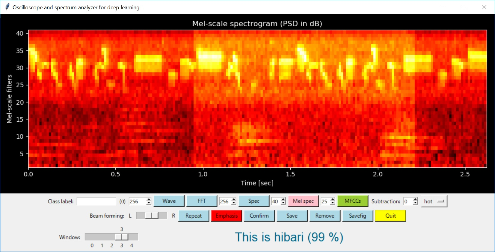

# CNN experiments with Keras/TensorFlow

The results: about 90% accuracy has been achieved, so it is satisfying.

### Jupyter Notebook of this experiment

I have made CNN experiments as follows:

- [CNN experiments on musical instruments recognition](./musical_instruments_cnn_success_1.ipynb)
- [CNN experiments on human activity in my home](./my_home_cnn_success_1.ipynb)
- [CNN experiments on key word detection](./key_word_detection_cnn_success_1.ipynb)
- [DNN experiments on key word detection](./key_word_detection_dnn_success_1.ipynb)
- [CNN experiments on my life environment](my_life_environment_cnn_success_1.ipynb)

The trained CNN model will work OK if the following condition is satisfied:
- use the same MEMS mic with the same filter setting (incl. the same frequency response) on the edge device (STM32L4)
- same environment
- less surrounding noise
- same beam forming setting
- same window setting

### Class labels and data set

#### MFSC feature set

##### Pattern 1

```
Classes of musical instruments recognition:
- piano music
- classial guitar music
- framenco guitar music
- blues harp music
- tin whistle music

Classes of human activity recognition:
- bathing
- cocking
- moving
- silence
- tooth brushing
- washing the dishes
- watching the TV

Conditions:
- Pre emphasis enabled on the raw data.

I split each 40 mel-filters x 200 strides data into three three 40 x 64 data.
```
##### Pattern 2

```
Classes of birds chirping recognition:
- suzume
- uguisu
- hibari

Conditions:
- Pre emphasis enabled on the raw data.

I moved a window over each 40 mel-filters x 200 strides data to extract the image that contains feature.
```

#### MFCC feature set

MFCCs are good for speech recognition.

```
Classes of speech recognition:
- umai ("delicious" in Japanese)
- oishii ("delicious" in Japanese)
- mazui ("bad" in Japanese)
- others

Conditions:
- Pre emphasis enabled on the raw data.

I split each 40 MFCCs x 200 strides data into two 12 x 96 data.
```

### Using the trained CNN model



- [Musical instruments recognition](./run_inference_music.bat)
- [Birds chirping recognition](./run_inference_birds.bat)
- [Speech recognition for restaurants](./run_inference_restaurant.bat)

I am looking forward to CubeMX.AI: https://www.st.com/content/st_com/en/about/innovation---technology/artificial-intelligence.html
