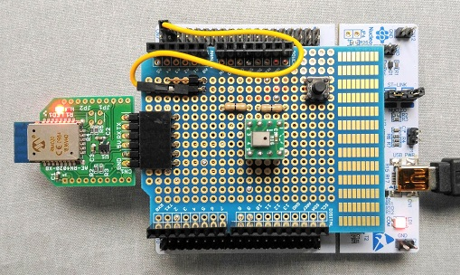
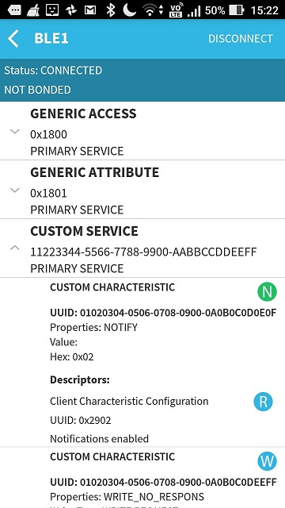

# Wireless transport

## BLE module "Microchip RN4020"

I follow the output from my [iot-wireless](https://github.com/araobp/iot-wireless) project on github.

## Arduino shield

### Receiving inference results from the shield over BLE

I use [BLE Scanner](https://play.google.com/store/apps/details?id=com.macdom.ble.blescanner&hl=en) on Android for testing the wireless transport.

The following is a screen capture of receiving inference results from the shield over BLE:

